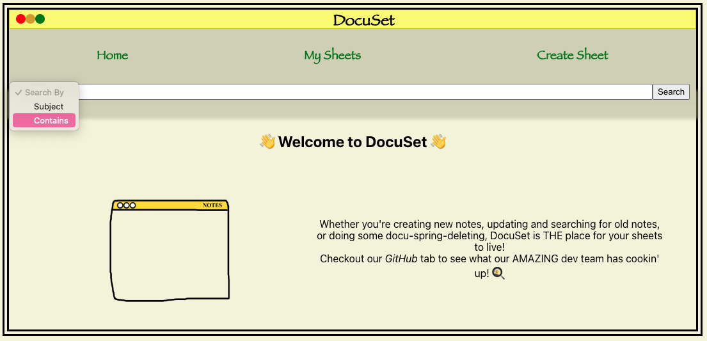
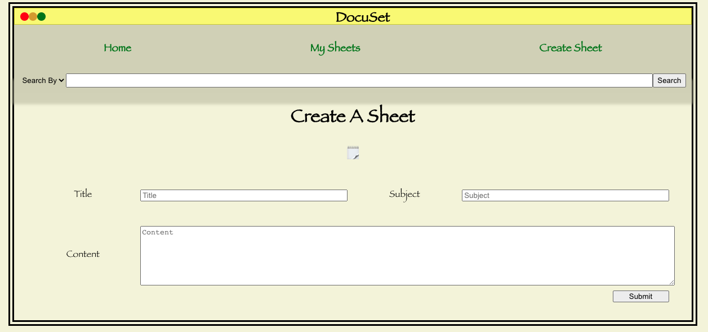

# DocuSet

## In App Snapshots

## What's DocuSet?!
  Docuset is the Ultimate Note Taking App, not only do we offer our users the typical functionality of most present day apps - create, update, delete, edit - our users have the ability to share their notes across devices! Additionally, we offer users the ability to search their set of sheets by Title and Keywords and many more state of the art features coming soon!

## Features
  Docuset Features Include:
  - Database Storage allowing user sheets to be accessible across all internet capable devices!
  - The ability to Create, Update, Delete, and search your sheets

## Up and Coming Features
  Our devs are currently in the process of implementing:
  - Rich Text Editors for an enhanced note taking experience
  - User Accounts - which will unlock a slew of features in the works! You can expect to see:
    - Login and Create Account Pages!
    - The ability to collaborate with peers!
    - A live feed of Notes from you and users you're connected with!
    - Comment and 'Liking' capability!

  ### _Think Facebook-- but for notes!_

## Technologies Used
 Docuset's Front-End UI is powered by JavaScript and React Framework ⚛️ - with added touches of CSS for Styling! 🎨

## Wireframes
  
  
  

## Installation
To use docuset you can:
- 👉 <a href="https://cheatsheetmern.netlify.app/">Click Here</a> 👈

## Feedback is ALWAYS Welcome!
> Feedback and recommendations are to be received via email at <i>awesomestDevTeam@feelintheMERN.com</i>

Email address is to be up and running when Google purchases our app within the coming months! Talk to you soon! 💬
